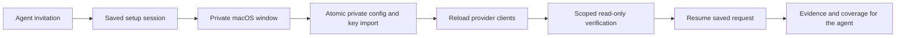

# Connect once, let the agent continue

This source branch adds private Apple account setup and four MCP tools. The
published v0.0.2-alpha archive does not include this flow yet.

The user accepts one invitation, signs into Apple in their browser, and adds a
key in AppScope's private window. AppScope remembers the request, checks access,
and continues it. Credentials never travel through a tool argument or result.

## User flow

1. Ask for a report or keyword research. Public data works immediately.
2. If an account would add missing evidence, the agent offers a short explanation
   and a choice: connect, later, or continue without it. Each account is optional.
3. Accepting opens a private window with the relevant Apple account page and help.
   Apple sign-in, 2FA, account permissions, and API-key creation remain with Apple.
4. For App Store Connect, choose or drop the downloaded team key. Its filename can
   fill the key ID. Paste labeled API details or enter the remaining IDs privately.
   For Apple Ads, AppScope prepares a key pair when needed; copy its **public** key
   to Apple and paste the resulting client IDs back into the private form.
5. Choose **Connect and continue**. The window closes. The running MCP server
   verifies access and resumes the saved request; the agent retrieves the result.

The server can reuse an existing configured account without showing a window.
If the user closes setup or calls `cancel_connection`, continuation stops and
invitations for that provider/app are snoozed for seven days if no active choice
already applies. Cancellation preserves an existing later choice or permanent
decline, including its original expiry. A later choice also
suppresses invitations for seven days; a decline suppresses them until an explicit
retry. Decisions are
saved per provider/app, across countries and chats. A decision without an app ID
applies to that account across apps. An active app-specific choice takes precedence;
when a temporary app choice expires, any account-wide choice still applies.

There is no Apple OAuth redirect flow in this implementation. No Apple account
password, sign-in code, or private-key text belongs in chat. Analytics report
enablement remains the separate, explicitly approved Admin CLI operation.

## MCP host contract

Use `interaction: interactive` on relevant requests in a live conversation.
Omitting it uses `background`: no invitations or setup windows. Existing response
fields, partial data, freshness and health keep their previous meanings.
Tool discovery advertises this convention, so an agent can use it on an ordinary
report request without being given a separate setup prompt. The host must follow
the convention; the server cannot determine whether an unspecified request came
from a conversation or scheduler.

When configuration is missing or invalid, a background response returns a
`setup_needed` action with `requires_user_consent` and
`requires_interactive_context` set to true. This action has no executable tool or
command. Keep it as nonblocking host guidance; do not prompt, open a window, or
silently change a scheduled request to interactive. In a live conversation, repeat
the original tool with `interaction: interactive` to obtain the scoped invitation.
Saved declines and active deferrals suppress this action as well as invitations.

Every `setup_status`, `check_connections`, report, refresh, and account-data tool
returns an additive `onboarding` object. Relevant credential errors carry it too.
Each provider includes `connection_state`, missing and verified capabilities,
verification app/country/time, `should_invite`, suppression reason, and a structured
`next_action`. The host must actually show the invitation; JSON alone is not a UI.

| Tool | Agent responsibility |
|---|---|
| `start_connection` | Call after consent. Pass the original `resume_tool` and `resume_arguments`, provider, app/country, and `interaction: interactive`. |
| `connection_status` | Keep the session ID. Use `wait_seconds: 20` while setup is open. Retrieve `result` when completed. Busy means another worker owns the session; back off before checking again. |
| `connection_decision` | Record the user's `later` or `decline` choice. This also cancels waiting work for that provider/app. |
| `cancel_connection` | Stop setup/continuation and snooze invitations for seven days. Already saved keys and observations remain. An in-flight request may finish before cancellation is observed. |

`resume_arguments` must match the selected tool's schema; it cannot contain keys,
file paths, arbitrary commands, or a different app/country. Supported continuations
are `daily_report`, `aso_strategy`, `refresh_app`, `app_performance`,
`keyword_suggestions`, `search_term_popularity`, and `owned_apps`. App-scoped tools
need `app_id`. Account discovery and genre demand can connect before an app is selected.

Stop polling on `needs_attention`, `cancelled`, `expired`, or `completed`.
`needs_attention.next_action` gives a repair or deliberate retry. Reopening a window
uses `start_connection` with the same request and `reopen_window: true`. Repeated
start calls reuse an active matching session. A different request cannot overwrite it.
`retry: true` on start overrides a saved decline or cancellation snooze only when
the user has explicitly asked to connect or retry. Expiry after 24 hours stops a
session without changing the user's invitation preference.

If the host cannot show native UI, the result provides a local `connection-window`
command. The Terminal `configure` commands also work. The host must use the same
data/config environment; it must not pipe credentials into a tool. Set
`APPSCOPE_DISABLE_SETUP_UI=1` to explicitly disable window launch on a headless host.
If the MCP server stops, credentials remain saved and the next server or status call
can recover the request. No work continues after the server exits.

Use the [interactive host prompt](../examples/interactive-setup.md) and keep
[scheduled jobs](../examples/hex-daily-job.md) noninteractive.

## Connection evidence

| State | Meaning and next step |
|---|---|
| `not_configured` | Required fields are absent; offer the relevant account in an interactive conversation. |
| `configured_unverified` | Strings exist, but current scoped access has not been checked. Run a bounded check. |
| `verified` | A named capability worked for the given app/country and credential version. Inspect capabilities; a successful app lookup does not prove report downloads. |
| `invalid_credentials` | Signing failed or Apple rejected authentication. Repair the private setup. |
| `access_denied` | Apple denied the requested access. Review the account role and scope. |
| `partial_access` | App access worked but report-request access failed. Preserve the successful capability. |
| `reports_not_enabled` | Connection works; an Admin must approve report enablement separately. |
| `reports_pending` | Connection works; Apple has not produced downloadable reports yet. |
| `verification_failed` | A network or other check failed. Retry verification without assuming the key is invalid. |

Evidence expires after 24 hours and is invalidated by configuration or key changes.
It never implies every app, term, country, date, report, or device rank was checked.
Report health and coverage remain authoritative for data completeness.

## Implementation and recovery

- `Onboarding.swift` supplies capability evidence and next actions.
- `ConnectionSessions.swift` stores consent decisions, sessions, cancellation,
  bounded verification, and continuation. SQLite revisions plus OS locks prevent
  competing helper/server processes from advancing the same session together.
- The MCP server checks ready sessions while running. The status tool can recover
  them too. A session expires after 24 hours; failures wait for an explicit retry.
- Report continuations reserve a **new** refresh ID before collection. Old runs
  with credential-related skips cannot count as newly collected data. Keywords
  and refresh options are frozen; each call or worker pass does at most five steps
  by default. Explicit status calls can request up to twenty steps.
- A resumed `daily_report` or `aso_strategy` collects both popularity and
  performance, including the already connected provider. Missing providers remain
  explicit skips and can receive their own invitation. A resumed `refresh_app`
  retains its original provider flags, including explicit exclusions. Report
  continuations return a `result` containing `run`, `report`, and `onboarding`;
  check both run status and report coverage before describing completeness.
- `ConnectionWindow.swift` runs as a separate process with stdio detached from MCP.
  A private, executable-hash-keyed app wrapper under `connection-ui/` gives macOS
  a normal window identity. Installation still ships one executable.
- Local file selection rejects symlinks, oversized files, nonregular files and
  invalid P-256 keys. Import writes a 0600 copy under `keys/`, preserves the source,
  rejects stale edits to the same provider, and preserves the other provider.
- Config reload rebuilds provider clients and discards old Ads tokens. Internal
  credential fingerprints bind evidence to the checked version and stay out of MCP.

New `connection_*` record kinds reuse the existing SQLite schema. No destructive
migration is required. Setup records contain the original noncredential request,
sanitized verification and results; keys remain in private files. There is no
automatic pruning of records, keys, or cached app wrappers.
